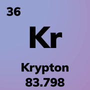

# Krypton'a hoşgeldin!

Selamlar, Krypton nedir? dediğini duyar gibiyim. Krypton, Python'a dönüşen bir yazılım dili. VE TAMAMEN TÜRKÇE. Evet yanlış duymadın Python syntax'ının biraz daha yalın ve Türkçe hali gibi düşünebiliriz Krypton'u.
Her ne kadar Krypton'a bir yazılım dili olarak demek doğru olmasada yerleşik kütüphaneleri ile öğrenim sürecinde çok fazla kişiye yardımcı olacağını düşünüyorum.
